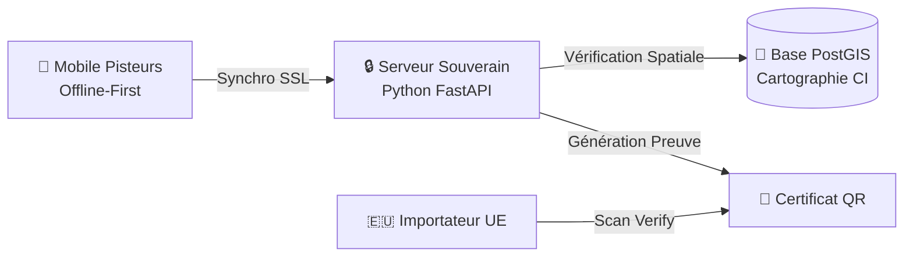

# 🛡️ Cocoa-Shield: Souveraineté Numérique du Cacao Ivoirien
> Projet candidat au Hackathon SIADE 2026 - Thème : Agriculture Intelligente & Souveraineté.

## 💡 Le Concept
**Cocoa-Shield** est une infrastructure de traçabilité "Offline-First" conçue pour répondre aux exigences du règlement européen **RDUE (EUDR)** sans compromettre la souveraineté des données géographiques ivoiriennes.

Contrairement aux solutions SaaS étrangères, Cocoa-Shield permet de vérifier la conformité (Non-Déforestation) localement et de générer une **Preuve à Divulgation Nulle de Connaissance (Zero-Knowledge Proof)** pour l'export.

## 📐 Architecture du Système
Le système est conçu pour garantir la souveraineté numérique de la Côte d'Ivoire. Les données sensibles ne quittent jamais le serveur national.



### Flux de Données Sécurisé

1. **Collecte Terrain :** Le pisteur enregistre le polygone du champ (sans internet).
2. **Traitement Souverain :** Le serveur croise les données avec la carte des Forêts Classées (SODEFOR/Parcs Nationaux).
3. **Protection :** Les coordonnées GPS brutes restent stockées en local (Intranet/Datacenter CI).
4. **Export :** Seul le statut de conformité (Booléen) est partagé avec l'acheteur via un certificat signé.

## 🏗️ Stack Technique

Le projet repose sur une stack Open Source robuste et déployable en souveraineté.

* **📱 Mobile (Pisteurs) :** Flutter (Mode 100% Offline pour zones blanches).
* **🧠 Backend (Souverain) :** Python (FastAPI).
* **🗺️ Core SIG :** PostgreSQL + PostGIS (Moteur spatial).
* **🔒 Sécurité :** Chiffrement AES-256 des polygones parcellaires.
* **📦 Déploiement :** Docker / Docker Compose.

## 🛠️ Installation & Démo

Pour lancer le prototype backend et la visualisation :

```bash
# 1. Lancer l'environnement
docker-compose up -d --build

# 2. Accéder à l'API de validation
# URL : http://localhost:8000/docs

# 3. Générer la carte de démonstration (HTML)
docker exec -it cocoa_api python visualize.py

```

## 🚀 Roadmap (Hackathon)

* [x] Initialisation de l'environnement Docker (PostGIS).
* [x] Ingestion des données cartographiques (Simulation Parc du Banco).
* [x] Développement de l'API de validation spatiale (Python/FastAPI).
* [x] Module de visualisation cartographique (Folium).
* [ ] Prototype Mobile de collecte terrain (Flutter).
* [ ] Démo finale : Génération du Certificat de Conformité (QR Code).

---

*Développé par la Team Cocoa-Shield.*
